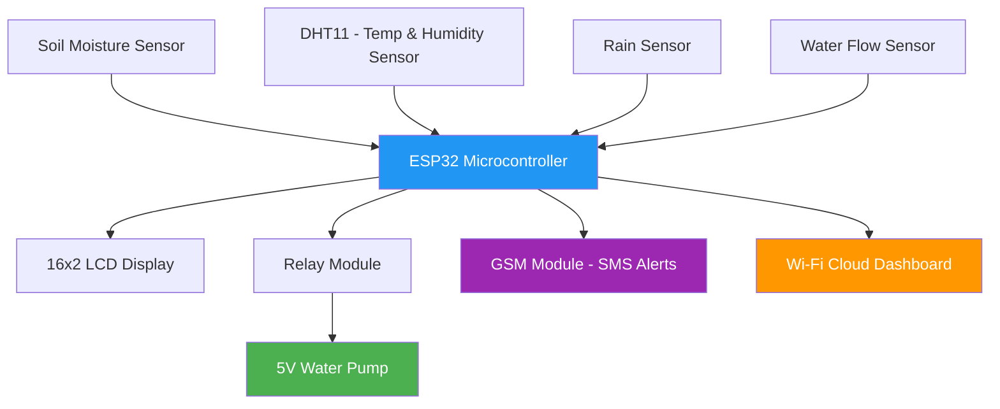
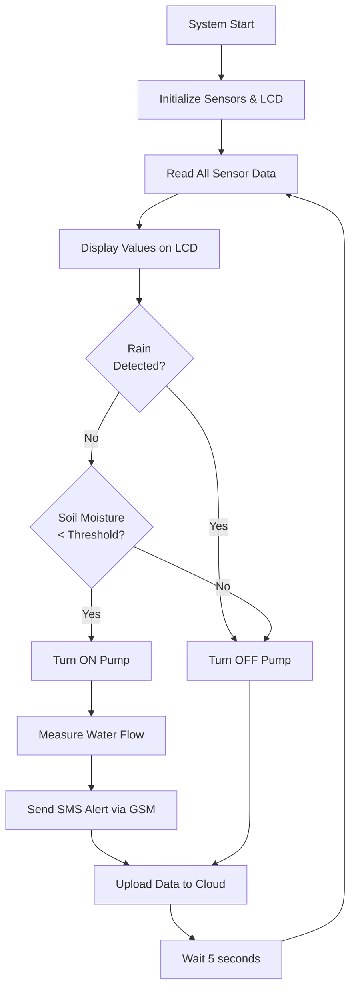

# Smart Irrigation System using ESP32

> **Centre of Innovation in IoT — Silicon Labs Project Challenge Submission**  
> An IoT-based automated irrigation system that monitors soil moisture, temperature, rainfall, and water flow in real-time, and controls a water pump automatically — reducing water wastage and improving crop yield.

---

## 1. Project Overview

### Problem Statement

Water scarcity is one of the most critical challenges facing agriculture today. Traditional irrigation methods rely heavily on manual intervention and fixed schedules, often leading to over-irrigation or under-irrigation — both of which negatively impact crop health and waste precious water resources.

In India alone, agriculture accounts for over 80% of total freshwater consumption. Small and medium-scale farmers lack access to smart, affordable tools that can automate irrigation based on actual soil and environmental conditions.

### Our Solution

The **Smart Irrigation System** is an IoT-based solution built around the **ESP32 microcontroller** that:

- Continuously monitors **soil moisture**, **ambient temperature & humidity**, and **rainfall** conditions
- Automatically activates or deactivates a water pump via a **relay module** based on sensor thresholds
- Measures actual **water flow** to track consumption in real time
- Displays live sensor data on a **16×2 LCD display** for on-site visibility
- Sends **SMS alerts** to the farmer via a **GSM module** when irrigation starts, stops, or anomalies are detected
- Enables **remote monitoring** via Wi-Fi (ESP32 built-in) and a cloud dashboard

### Who It Is For

- Small and medium-scale farmers
- Agricultural research institutions
- Smart greenhouse operators
- Urban rooftop and kitchen garden enthusiasts

### Why It Matters

This project directly addresses **UN Sustainable Development Goal 2 (Zero Hunger)** and **SDG 6 (Clean Water and Sanitation)** by making precision irrigation affordable and accessible using low-cost, widely available components.

---

## 2. Technical Architecture

### Block Diagram



### System Flow



### Communication Architecture

```
[Sensors] ──analog/digital──► [ESP32] ──I2C──► [LCD Display]
                                  │
                                  ├──GPIO──► [Relay] ──► [Water Pump]
                                  │
                                  ├──UART──► [GSM Module] ──► [Farmer's Phone via SMS]
                                  │
                                  └──Wi-Fi──► [Cloud / Dashboard]
```

---

## 3. Technologies Used

### Wireless Technologies
- **Wi-Fi (2.4 GHz)** — ESP32 built-in, used for cloud data upload and remote monitoring
- **GSM (2G)** — SIM800L/SIM900 module for SMS alerts to farmer's mobile

### Programming Languages
- **C / C++** — Arduino framework on ESP32
- **MicroPython** (optional alternative firmware)

### Frameworks & Tools
- **Arduino IDE** — Firmware development and flashing
- **ThingSpeak / Blynk** — Cloud IoT dashboard for real-time data visualization
- **PlatformIO** (optional) — Advanced build system

### Protocols
- **I2C** — LCD display communication
- **ADC (Analog to Digital Conversion)** — Soil moisture and rain sensor readings
- **UART** — GSM module communication
- **Digital GPIO** — Relay control, water flow pulse counting

---

## 4. Hardware Components

### Primary Microcontroller
| Component | Specification |
|-----------|--------------|
| ESP32 NodeMCU | Dual-core 240MHz, Wi-Fi + Bluetooth, 38 GPIO pins |

### Sensors
| Sensor | Purpose | Interface |
|--------|---------|-----------|
| Capacitive Soil Moisture Sensor | Measures soil water content (0–100%) | Analog (ADC) |
| DHT11 / DHT22 | Ambient temperature (°C) and humidity (%) | Digital GPIO |
| Rain Sensor Module | Detects presence and intensity of rainfall | Analog + Digital |
| Water Flow Sensor (YF-S201) | Measures water flow rate (L/min) | Digital pulse |

### Output & Control
| Component | Purpose |
|-----------|---------|
| 5V Relay Module (1-channel) | Controls water pump ON/OFF |
| 5V Mini Water Pump | Delivers water to crops |
| 16×2 LCD Display (with I2C adapter) | Displays live sensor readings |

### Communication
| Component | Purpose |
|-----------|---------|
| GSM Module (SIM800L / SIM900A) | Sends SMS alerts to farmer |

### Supporting Components
| Component | Quantity |
|-----------|---------|
| Breadboard | 2 |
| Jumper wires (M-M, M-F) | ~40 |
| USB to Micro-USB cable | 1 |
| 5V / 2A Power Supply | 1 |
| Cardboard base (prototype mounting) | 1 |

---

## 5. Working Methodology

### Step-by-Step Operation

1. **Initialization**: ESP32 boots up, initializes all sensor pins, LCD display via I2C, GSM module via UART, and connects to Wi-Fi.

2. **Sensor Reading Loop** (every 5 seconds):
   - Reads analog value from soil moisture sensor → converts to % moisture
   - Reads temperature and humidity from DHT11
   - Reads rain sensor (analog + digital threshold)
   - Counts pulses from water flow sensor → calculates L/min

3. **Decision Logic**:
   - If **rain detected** → Pump stays OFF (no irrigation needed)
   - If **soil moisture < threshold (e.g., 40%)** AND no rain → Pump turns ON
   - If **soil moisture > threshold (e.g., 70%)** → Pump turns OFF
   - Thresholds can be adjusted per crop type in firmware

4. **Display**: All readings shown on 16×2 LCD — scrolling between moisture %, temperature, and pump status.

5. **Alerts**: GSM module sends SMS to farmer's registered number:
   - "Irrigation Started – Moisture: 32%, Temp: 28°C"
   - "Irrigation Stopped – Soil is adequately moist"
   - "Rain Detected – Pump deactivated"

6. **Cloud Upload**: ESP32 sends data to ThingSpeak/Blynk every 15 seconds for remote dashboard viewing.

### Irrigation Threshold Table (Configurable)

| Crop Type | Start Irrigation (Moisture %) | Stop Irrigation (Moisture %) |
|-----------|------------------------------|------------------------------|
| Wheat | < 35% | > 65% |
| Rice | < 50% | > 80% |
| Vegetables | < 40% | > 70% |
| Default | < 40% | > 70% |

---

## 6. Circuit Design / Pin Mapping

### ESP32 Pin Connections

| Component | ESP32 Pin | Type |
|-----------|-----------|------|
| Soil Moisture Sensor (OUT) | GPIO 34 | Analog Input |
| DHT11 (DATA) | GPIO 4 | Digital I/O |
| Rain Sensor (A0) | GPIO 35 | Analog Input |
| Rain Sensor (D0) | GPIO 14 | Digital Input |
| Water Flow Sensor | GPIO 18 | Digital Input (Interrupt) |
| Relay Module (IN) | GPIO 26 | Digital Output |
| LCD SDA (I2C) | GPIO 21 | I2C Data |
| LCD SCL (I2C) | GPIO 22 | I2C Clock |
| GSM TX | GPIO 17 | UART TX |
| GSM RX | GPIO 16 | UART RX |

> **Note**: All sensors powered from 3.3V / 5V rails on breadboard. Relay and pump powered from external 5V supply.

---

## 7. Software Components / Dependencies

### Arduino Libraries Required

```
- DHT sensor library (Adafruit) v1.4.x
- LiquidCrystal_I2C v1.1.2
- ThingSpeak library v2.0.0 (for cloud)
- WiFi.h (built-in ESP32 core)
- SoftwareSerial / HardwareSerial (GSM communication)
- PubSubClient (optional, for MQTT)
```

### Installation (Arduino IDE)

```bash
# Install ESP32 Board Package
# Tools → Board → Boards Manager → Search "ESP32" → Install by Espressif Systems

# Install libraries via Library Manager
# Sketch → Include Library → Manage Libraries
# Search and install: DHT, LiquidCrystal_I2C, ThingSpeak
```

### External Software Dependencies
- **Arduino IDE** v2.x — [https://www.arduino.cc/en/software](https://www.arduino.cc/en/software)
- **ThingSpeak Account** (free) — [https://thingspeak.com](https://thingspeak.com)
- **Blynk App** (optional) — [https://blynk.io](https://blynk.io)
- **SIM card** with SMS pack (for GSM alerts)

---

## 8. Current Progress & Future Scope

### ✅ Current Progress

| Feature | Status |
|---------|--------|
| Hardware assembly on breadboard | ✅ Complete |
| Soil moisture sensing + relay control | ✅ Complete |
| Rain sensor integration | ✅ Complete |
| LCD display showing live readings | 🔄 In Progress |
| GSM SMS alerts | ✅ Integrated |
| Water flow measurement | ✅ Integrated |
| DHT11 temperature/humidity reading | ✅ Complete |
| Wi-Fi connectivity + cloud upload | 🔄 In Progress |
| Mobile dashboard (Blynk) | 🔄 In Progress |

### 🚀 Future Scope

1. **Solar-Powered Operation** — Add a solar panel and LiPo battery for fully off-grid deployment in remote farmlands

2. **AI-based Crop-Specific Thresholds** — Machine learning model that automatically adjusts irrigation thresholds based on crop type, growth stage, and local weather forecast (via OpenWeatherMap API)

3. **Multi-Zone Irrigation** — Expand to control multiple pumps/valves independently for different crop zones

4. **Voice Alerts in Local Language** — Use a DFPlayer Mini module to announce alerts in Hindi or other regional languages for farmers with basic mobile phones

5. **Water Consumption Analytics** — Weekly/monthly water usage reports sent via WhatsApp or email to help farmers optimize water budgeting

6. **PCB Design** — Convert the breadboard prototype to a custom PCB for ruggedized field deployment

7. **LoRa Integration** — Replace GSM with LoRa (Long Range) radio for farms in areas with no cellular coverage

---

## 9. Repository Structure

```
smart-irrigation-esp32/
│
├── firmware/
│   ├── smart_irrigation.ino       # Main Arduino sketch
│   ├── config.h                   # Wi-Fi credentials, thresholds, phone number
│   └── gsm_alerts.h               # GSM SMS helper functions
│
├── hardware/
│   ├── block_diagram.png          # System block diagram
│   ├── circuit_schematic.png      # Fritzing/KiCad schematic
│   └── hardware_photo.jpg         # Real prototype photo
│
├── docs/
│   ├── project_overview.md        # Detailed documentation
│   └── setup_guide.md             # How to replicate this project
│
├── README.md                      # This file
└── LICENSE                        # MIT License
```

---

## 10. Licensing

This project is licensed under the **MIT License** — open for educational and commercial use with attribution.

Third-party libraries used retain their original licenses:
- Adafruit DHT Library — BSD License
- LiquidCrystal_I2C — LGPL
- ThingSpeak Arduino Library — Apache 2.0

---

## 11. Maintainers / Contacts

| Name | Roll Number | Role |
|------|-------------|------|
| Anant Srivastava | 2315000272 | Project Lead & Hardware |
| Sahil Singh | 2315001925 | Firmware & Cloud Integration |
| Priyanshu Kumar | 2315001708 | Sensor Integration & Testing |
| Aditya Baghel | 2315000103 | Circuit Design & Assembly |
| Jayveer | 2315001029 | Documentation & Presentation |

> **Institution**: GLA University, Mathura — Department of Electronics & Communication Engineering  
> **Mentor**: Dr. Arnab Panda  
> **Submission**: Silicon Labs Centre of Innovation in IoT — May 2026

---

## GitHub Topics to Add

```
iot, esp32, smart-irrigation, agriculture, soil-moisture, gsm, arduino, 
silabs-coi, water-conservation, embedded-systems, centre-of-innovation-in-iot
```

---

*Built with ❤️ for farmers. Powered by ESP32 and Silicon Labs CoI Initiative.*
