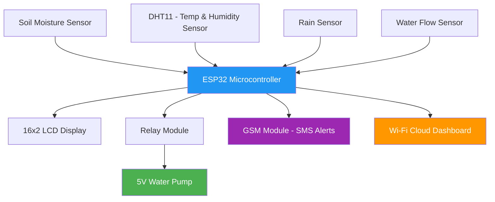
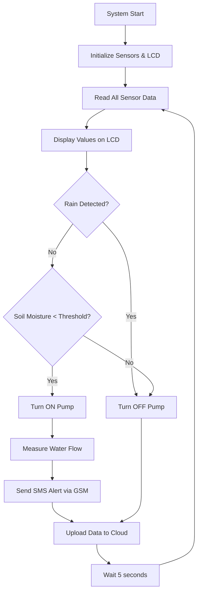

# Smart Irrigation System using ESP32

> An IoT-based automated irrigation system that monitors soil moisture, temperature, rainfall, and water flow in real-time, and controls a water pump automatically — reducing water wastage and improving crop yield.

---

## 1. Project Overview

Water scarcity is one of the most critical challenges facing agriculture today. Traditional irrigation methods rely on manual intervention and fixed schedules, often leading to over-irrigation or under-irrigation — both of which negatively impact crop health and waste precious water resources.

The **Smart Irrigation System** is an IoT-based solution built around the **ESP32 microcontroller** that:

- Continuously monitors **soil moisture**, **ambient temperature & humidity**, and **rainfall** conditions
- Automatically activates or deactivates a water pump via a **relay module** based on sensor thresholds
- Measures actual **water flow** to track consumption in real time
- Displays live sensor data on a **16×2 LCD display** for on-site visibility
- Sends **SMS alerts** to the farmer via a **GSM module** when irrigation starts, stops, or anomalies are detected
- Enables **remote monitoring** via Wi-Fi (ESP32 built-in) and a cloud dashboard

**Target Users:** Small and medium-scale farmers, agricultural research institutions, smart greenhouse operators, and urban garden enthusiasts.

This project directly addresses **UN SDG 2 (Zero Hunger)** and **SDG 6 (Clean Water and Sanitation)** by making precision irrigation affordable and accessible.

---

## 2. Technical Architecture

### Block Diagram



### System Flow



---

## 3. Technologies Used

- **Wireless Technologies:** Wi-Fi 2.4GHz (ESP32 built-in), GSM 2G (SIM800L for SMS alerts)
- **Programming Languages:** C / C++ (Arduino framework)
- **Frameworks:** Arduino Core for ESP32
- **Tools:** Arduino IDE v2.x, ThingSpeak (cloud dashboard), Blynk (mobile dashboard)
- **Protocols:** I2C (LCD), ADC (soil moisture & rain sensor), UART (GSM), Digital GPIO (relay & flow sensor)

---

## 4. Hardware Components

### Silicon Labs Hardware
- This project is developed as part of the **Silicon Labs Centre of Innovation in IoT** initiative.
- Silicon Labs IoT ecosystem principles and guidelines are followed for architecture and connectivity design.

### External Hardware

| Component | Purpose |
|-----------|---------|
| ESP32 NodeMCU (Dual-core 240MHz, Wi-Fi + BT) | Main microcontroller |
| Capacitive Soil Moisture Sensor | Measures soil water content (0–100%) |
| DHT11 Temperature & Humidity Sensor | Ambient temperature (°C) and humidity (%) |
| Rain Sensor Module | Detects presence and intensity of rainfall |
| Water Flow Sensor (YF-S201) | Measures water flow rate (L/min) |
| 5V Relay Module (1-channel) | Controls water pump ON/OFF |
| 5V Mini Water Pump | Delivers water to crops |
| 16×2 LCD Display with I2C adapter | Displays live sensor readings |
| GSM Module (SIM800L) | Sends SMS alerts to farmer |
| Breadboard + Jumper Wires | Prototyping |
| 5V / 2A Power Supply | Powers the system |

### ESP32 Pin Mapping

| Component | ESP32 Pin | Type |
|-----------|-----------|------|
| Soil Moisture Sensor | GPIO 34 | Analog Input |
| DHT11 | GPIO 4 | Digital I/O |
| Rain Sensor (Analog) | GPIO 35 | Analog Input |
| Rain Sensor (Digital) | GPIO 14 | Digital Input |
| Water Flow Sensor | GPIO 18 | Digital Input |
| Relay Module | GPIO 26 | Digital Output |
| LCD SDA | GPIO 21 | I2C |
| LCD SCL | GPIO 22 | I2C |
| GSM TX | GPIO 17 | UART |
| GSM RX | GPIO 16 | UART |

---

## 5. Working Methodology

1. **Initialization** — ESP32 boots, initializes sensors, LCD, GSM, and connects to Wi-Fi
2. **Sensor Reading** (every 5 seconds) — reads soil moisture %, temperature, humidity, rain status, and water flow rate
3. **Decision Logic:**
   - Rain detected → Pump OFF
   - Soil moisture < 40% AND no rain → Pump ON
   - Soil moisture > 70% → Pump OFF
4. **Display** — Live readings shown on 16×2 LCD
5. **SMS Alerts** — GSM sends farmer notifications on pump ON/OFF and rain detection
6. **Cloud Upload** — Data sent to ThingSpeak every 15 seconds for remote monitoring

---

## 6. Current Progress & Future Scope

### Current Progress

| Feature | Status |
|---------|--------|
| Hardware assembly | ✅ Complete |
| Soil moisture sensing + relay control | ✅ Complete |
| Rain sensor integration | ✅ Complete |
| DHT11 temperature/humidity reading | ✅ Complete |
| GSM SMS alerts | ✅ Complete |
| Water flow measurement | ✅ Complete |
| LCD display showing live readings | 🔄 In Progress |
| Wi-Fi connectivity + cloud upload | 🔄 In Progress |
| Mobile dashboard (Blynk) | 🔄 In Progress |

### Future Scope

- **Solar-powered operation** for off-grid deployment
- **AI-based crop-specific thresholds** using weather forecast API
- **Multi-zone irrigation** with independent pump/valve control
- **Voice alerts in local language** (Hindi) for farmers
- **PCB design** for ruggedized field deployment
- **LoRa integration** for farms with no cellular coverage

---

## 7. Software Components / Dependencies

### Silicon Labs Dependencies
- This project follows Silicon Labs CoI IoT campaign guidelines

### External Software Dependencies

| Library | Version | Purpose |
|---------|---------|---------|
| DHT sensor library (Adafruit) | v1.4.x | Temperature & humidity reading |
| LiquidCrystal_I2C | v1.1.2 | LCD display control |
| ThingSpeak Arduino Library | v2.0.0 | Cloud data upload |
| WiFi.h | Built-in (ESP32 core) | Wi-Fi connectivity |
| HardwareSerial | Built-in | GSM UART communication |

**Tools Required:**
- Arduino IDE v2.x — https://www.arduino.cc/en/software
- ThingSpeak Account (free) — https://thingspeak.com
- Blynk App (optional) — https://blynk.io

---

## 8. Licensing

This project is licensed under the **MIT License** — open for educational and commercial use with attribution.

Third-party library licenses:
- Adafruit DHT Library — BSD License
- LiquidCrystal_I2C — LGPL
- ThingSpeak Arduino Library — Apache 2.0

---

## 9. Maintainers / Contacts

| Name | Role | Github Profile |
|------|------|----------------|
| Anant Srivastava (2315000272) | Project Lead & Hardware | https://github.com/anantsrivastava23 |
| Sahil Singh (2315001925) | Firmware & Cloud Integration | — |
| Priyanshu Kumar (2315001708) | Sensor Integration & Testing | — |
| Aditya Baghel (2315000103) | Circuit Design & Assembly | — |
| Jayveer (2315001029) | Documentation & Presentation | — |

> **Institution:** GLA University, Mathura — Department of Electronics & Communication Engineering
> **Mentor:** Dr. Arnab Panda
> **Submission:** Silicon Labs Centre of Innovation in IoT — May 2026

---

## GitHub Topics

```
iot, esp32, smart-irrigation, agriculture, soil-moisture, gsm, arduino,
centre-of-innovation-in-iot, water-conservation, embedded-systems
```

---

*Built with ❤️ for farmers. Powered by ESP32 and Silicon Labs CoI Initiative.*
